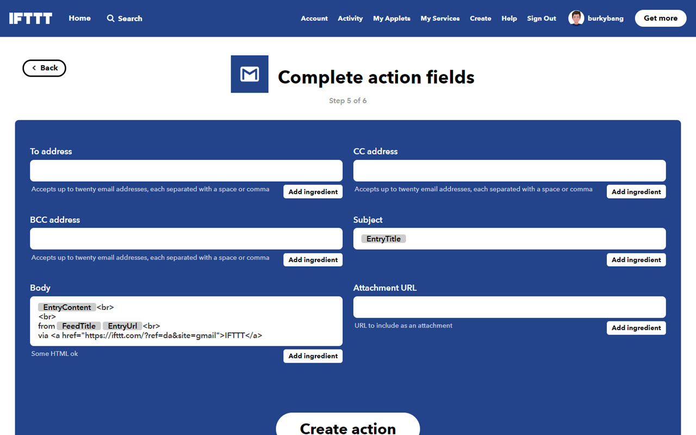

# Better IFTTT UI

This is a work in progress to make the IFTTT UI better on desktop.

This project is open source. If you'd like to contribute, please do so. I would love for this to be a community project.

## Download

- [Google Chrome / Microsoft Edge Beta](https://chrome.google.com/webstore/detail/diopohabmpmmpdabhghdpjnkhlicfjnp)
- [Mozilla Firefox](https://addons.mozilla.org/en-US/firefox/addon/better-ifttt-ui/)

## Screenshots

### Home Page

### Create Applet

### My Services
